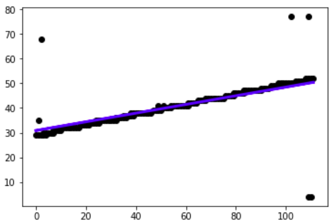

# Video Transition Detector v0.0.1

## Introduction

This is a tool built on python3.6 for video transition detection.

Currently we have made atuo detection for wipe transition.

We apply pipenv to manage the python package below:

- opencv: for image and video processing
- matplotlib: for linear regression debug
- numpy: for matrix manipulation
- PIL: for showing image from opencv in tkinter
- tkinter: for GUI
   
## Build Guide
```bash
# install depend packages
pipenv install
# run program
python3 main.py
```

## Presentation Video - Bob

## Feature list
- [ ] Video Transition Detection Based on **Spatio Temporal Image (STI)**
- [ ] **Copy pixel** 
    + Generate STI with middle column / row from origin frame of videl.
- [ ] **Histogram Difference**
    + Apply chromatic color sampling
    + Apply histogram mechanism
        * Histogram Intersection Method
        * IBM's Histogram Distance Method
    + Apply linear regression for auto detection
  

## Screenshots of Final Product - Bob

## Implementation Details

### STI based on Copy Pixel

The implementation of copy-pixel is to build up STI, whose number of cols is the number of frames and rows is the copy of mid row/col of frame,
when wipe transition happens in video, say horizontal wipe, we can see an apparent gap in STI if we sample the mid col.


It is easy but strongly relies on human's visual recognition.

### STI based on Histogram Difference

#### Compute Chromaticity

As is mentioned in the project requirement document, chromaticity ($\{r, g\}=\{R, G\}/(R+G+B)$)  of image is much more characteristic.

We implements a function that convert RGB channel into chromaticity.First 

We do this in per pixel level. This can be done by utilizing matrix element-wise operation provided by `numpy`, which can speed up the excution.

We first compute the sum of RGB, and divide R, G respectively.

```python
def bgr_to_rg(self, image_bgr):
    bgr_sum = (image_bgr[:, :, 0] + image_bgr_copy[:, :, 1] + image_bgr[:, :, 2] + 0.0000001)
    # red
    image_rg[:, :, 0] = image_bgr_copy[:, :, 2]
    # green
    image_rg[:, :, 1] = image_bgr_copy[:, :, 1]
    return image_rg
```

#### Calculate Histogram

We calculate histogram by utilizing `cv2.calcHist()`  function in `OpenCV`. We provide the channel we want to compute, R (0) and G (1), the bin size of the histogram is $N = 1 + log_2 (n)$ . 

```python
cv2.calcHist([image_rg], [0, 1], None, [bin_size, bin_size], [0, 1, 0, 1])
```

#### Intersection Method

We use **Intersection** to measure the similarity of two histograms.

$I = \sum_{i}\sum_{j} min (H_t(i,j), H_{t-1}(i,j))$


(Image referenced from [here](http://blog.datadive.net/histogram-intersection-for-change-detection/))

```python
for f in range(I.shape[1]):
    I[f] = np.sum(np.minimum(H[f + 1], H[f]))
    if I[f] < threshold:
        wipe_positions.append(col)
        wipe_frames.append(f)
```

We use element-wise `minimum` opeartion provided by `numpy` to compute the instersection. And iterate for each pair of adjacent frame of the video.

If the intersection is smaller than a threshold value, we determine there is a transition between the two frames

#### IBM's Method - Bob
This method is so-called **HQDM**(Histogram Quadratic Distance Measures). The main idea of it is to calculate the distance between two histograms, hq and ht by using the equation
$$ D_{HQDM}(q,t)=(h_q - h_t)^T A (h_q - h_t)$$
Here A is a predefined matrix where aij denotes the color  the similarity between color of bin i and color of bin j. It is a symmetrical metrix with all 1 on diagonal and becomes smaller to end of rows and cols. Obviously, The more similarity, the more weight of count difference contributes to the histograms difference.

```python
# generate A metrix
a_m = np.zeros((n ** 2, n ** 2), dtype=np.double)
        for i in range(n ** 2):
            for j in range(n ** 2):
                xi = i // n
                yi = i % n
                xj = j // n
                yj = j % n
                a_m[i, j] = 1 - math.sqrt((xi / n - xj / n) ** 2 + (yi / n - yj / n) ** 2) / math.sqrt(2)

# calculate difference, row sampling
for row in range(height):
    histogram_row = self.to_histogram(frame_chroma[row, :, :], n)
    v = histogram_row.reshape(histogram_row.size)
    if f == 0:
        histogram_vector_table.append(v)
    else:
        v_last = histogram_vector_table[row]
        z = np.abs(v - v_last)
        d_2 = (np.asmatrix(z) * np.asmatrix(a_m) * np.asmatrix(z).T)[0, 0]

        histogram_vector_table[row] = v[:]
        sti[row, f - 1] = d_2

```

#### Linear Regression - Leo

After we compute the difference of the histogram for frame of each column / row. We get a 2D array, with one axis is frame and the other is column / row. This 2D array is either 0 or 1 because we classify them by threshold value. Value 1 means we have determined there is a transition at that frame and that column / row. 

In order to get the start time and end time of the transition, and filter noise, we use **linear regression** to generate a line. And use this line as the transition line.

The principle of **linear regression** is to find a line that minimize the **square root error** for each points on the graph.

The fomular of linear regression is (from [Wikipedia](https://en.wikipedia.org/wiki/Linear_regression))



Based on the modelled line from the 2D array, we can **automatically** determine the start frame and end frame of transition.

For STI from columns, we give the column `0`, and `width-1` as input to the line function, we get the output as frame. One output is the start frame number, this other is end frame number.

## Problems and solutions
### opencv
`opencv` use `BGR` color format while `matplotlib` use `RGB` color format. Thus if we display the `opencv` image using `matplotlib` , we will get a wrong color image.

The solution is convert `BGR` to `RGB` before displaying using
```python
image = cv2.cvtColor(image, cv2.COLOR_BGR2RGB)
```

### pyplot
RuntimeError for using matpotlib on Mac
```bash
RuntimeError: Python is not installed as a framework. 
The Mac OS X backend will not be able to function correctly if Python is not installed as a framework. 
See the Python documentation for more information on installing Python as a framework on Mac OS X. 
Please either reinstall Python as a framework, or try one of the other backends. If you are using (Ana)Conda please install python.app and replace the use of 'python' with 'pythonw'. 
See 'Working with Matplotlib on OSX' inthe Matplotlib FAQ for more information.
```
Solution: [relevant github_issue](https://github.com/MTG/sms-tools/issues/36):
```python
import matplotlib as mpl
mpl.use("TkAgg")
import matplotlib.pyplot as plt
```
And there iscConflict between matplotlib && cv2.imshow. The RuntimeError above occur even if solution applied. Try to use only one of them (matplotlib) to show some image.


## Discussion

### About Project

#### Is `chromaticity`  really improve the characteristics of image?

One main drawback we found is `chromaticity` **enlarges the noise on dark image**. To illustrate this idea. There are two images below: one with RGB(0,0,0), and another (1, 0, 0) (RGB value from 0 to 255).


These two images is indistinguishable for human, but in `chromaticity` one is rg(0, 0) and another rg(1, 0). Their intersection is 0, which means they are totally different. 

So the `chromaticity` enlarges the noise in dark image because the **denominator** (R+G+B) is too small. It will regard some minor change in dark images as transition.

### Further Improvement