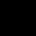

# Video Transition Detector

## Presentation Video - Bob

## Feature list - Bob

- [ ] Create **Spatio Temporal Image (STI)** of middle column / row from a video file.
- [ ] Detect **vertical / horizontal wipe automatically** of a video file using two methods
  - [ ] Method devoloped by IBM
  - [ ] Histogram intersection

## Screenshots of Final Product - Bob

## Implementation Details

### STI based on Copy Pixel - Bob

### STI based on Histogram Difference

#### Compute Chromaticity

As is mentioned in the project requirement document, chromaticity ($\{r, g\}=\{R, G\}/(R+G+B)$)  of image is much more characteristic.

We implements a function that convert RGB channel into chromaticity.First 

We do this in per pixel level. This can be done by utilizing matrix element-wise operation provided by `numpy`, which can speed up the excution.

We first compute the sum of RGB, and divide R, G respectively.

```python
def bgr_to_rg(self, image_bgr):
    bgr_sum = (image_bgr[:, :, 0] + image_bgr_copy[:, :, 1] + image_bgr[:, :, 2] + 0.0000001)
    # red
    image_rg[:, :, 0] = image_bgr_copy[:, :, 2]
    # green
    image_rg[:, :, 1] = image_bgr_copy[:, :, 1]
    return image_rg
```

#### Calculate Histogram

We calculate histogram by utilizing `cv2.calcHist()`  function in `OpenCV`. We provide the channel we want to compute, R (0) and G (1), the bin size of the histogram is $N = 1 + log_2 (n)$ . 

```python
cv2.calcHist([image_rg], [0, 1], None, [bin_size, bin_size], [0, 1, 0, 1])
```

#### Intersection Method

We use **Intersection** to measure the similarity of two histograms.

$I = \sum_{i}\sum_{j} min (H_t(i,j), H_{t-1}(i.j))$


(Image referenced from [here](http://blog.datadive.net/histogram-intersection-for-change-detection/))

```python
for f in range(I.shape[1]):
    I[f] = np.sum(np.minimum(H[f + 1], H[f]))
    if I[f] < threshold:
        wipe_positions.append(col)
        wipe_frames.append(f)
```

We use element-wise `minimum` opeartion provided by `numpy` to compute the instersection. And iterate for each pair of adjacent frame of the video.

If the intersection is smaller than a threshold value, we determine there is a transition between the two frames

#### IBM's Method - Bob

#### Linear Regression - Leo

After we compute the difference of the histogram for frame of each column / row. We get a 2D array, with one axis is frame and the other is column / row. This 2D array is either 0 or 1 because we classify them by threshold value. Value 1 means we have determined there is a transition at that frame and that column / row. 

In order to get the start time and end time of the transition, and filter noise, we use **linear regression** to generate a line. And use this line as the transition line.

The principle of **linear regression** is to find a line that minimize the **square root error** for each points on the graph.

The fomular of linear regression is (from [Wikipedia](https://en.wikipedia.org/wiki/Linear_regression))


Based on the modelled line from the 2D array, we can **automatically** determine the start frame and end frame of transition.

For STI from columns, we give the column `0`, and `width-1` as input to the line function, we get the output as frame. One output is the start frame number, this other is end frame number.

## Problems and solutions

### opencv & matplotlib

`opencv` use `BGR` color format while `matplotlib` use `RGB` color format. Thus if we display the `opencv` image using `matplotlib` , we will get a wrong color image.

The solution is convert `BGR` to `RGB` before displaying using

```python
image = cv2.cvtColor(image, cv2.COLOR_BGR2RGB)
```

### pyplot - Bob

## Discussion

### About Project

#### Is `chromaticity`  really improve the characteristics of image?

One main drawback we found is `chromaticity` **enlarges the noise on dark image**. To illustrate this idea. There are two images below: one with RGB(0,0,0), and another (1, 0, 0) (RGB value from 0 to 255).




These two images is indistinguishable for human, but in `chromaticity` one is rg(0, 0) and another rg(1, 0). Their intersection is 0, which means they are totally different. 

So the `chromaticity` enlarges the noise in dark image because the **denominator** (R+G+B) is too small. It will regard some minor change in dark images as transition.

### Further Improvement